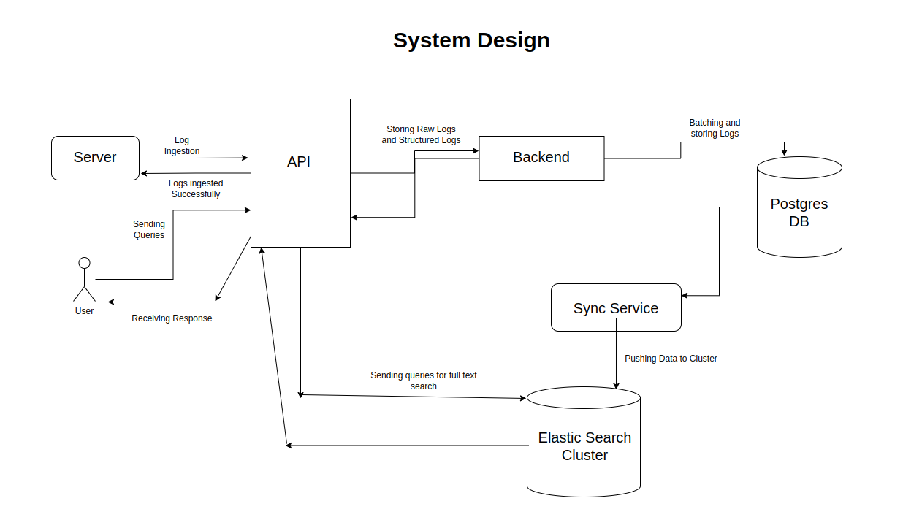
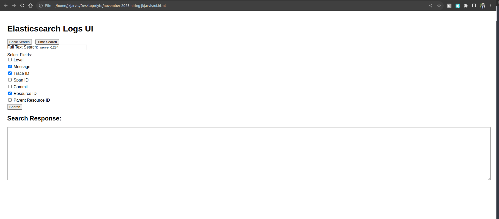
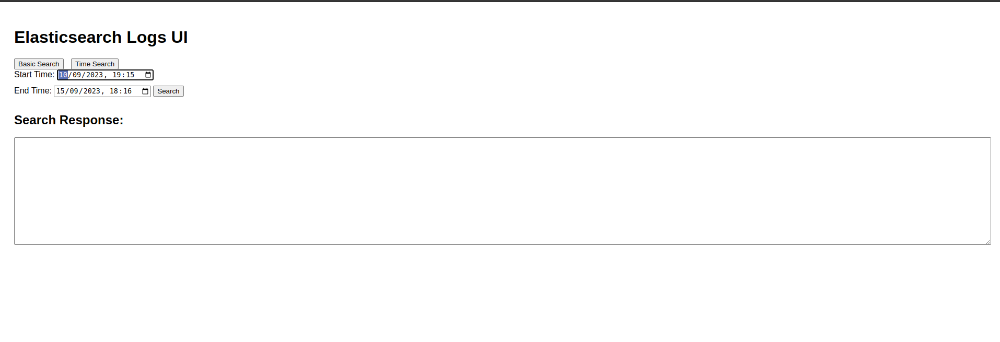

[](https://classroom.github.com/a/2sZOX9xt)
<!-- Improved compatibility of back to top link: See: https://github.com/othneildrew/Best-README-Template/pull/73 -->
<a name="readme-top"></a>
<!--
*** Thanks for checking out the Best-README-Template. If you have a suggestion
*** that would make this better, please fork the repo and create a pull request
*** or simply open an issue with the tag "enhancement".
*** Don't forget to give the project a star!
*** Thanks again! Now go create something AMAZING! :D
-->

## About the Project

This project is a solution to the given assignment by Dyte for the SDE1 position.
This project is build in Nodejs (v16.16.0), postgreSQL and ElasticSearch.

This project is divided into two usecases:

### 1. Log Ingestion Service

Log ingestion service allows a user to store logs for their system. We have exposed an endpoint `http://SERVER_URL:3000/` on port 3000.
This endpoint acceps a POST request with following data structure:

```
{
	"level": "error",
	"message": "Failed to connect to DB",
    "resourceId": "server-1234",
	"timestamp": "2023-09-15T08:00:00Z",
	"traceId": "abc-xyz-123",
    "spanId": "span-456",
    "commit": "5e5342f",
    "metadata": {
        "parentResourceId": "server-0987"
    }
}
```

We are maintaining two Database tables for storing logs:
1. **RawLogs table** : this stores all the incoming data in its original format. This is maintained to check and verify if any field value was missed or not mentioned in the original request.
2. **Logs table** : this stored the incoming data in a structure format. All the data is first normalized and then stored into this table.

### 2. Search Service
In search service, we are exposing an api endpoint `http://SERVER_URL:3000/search`. This endpoint returns response for the specific query.
We are running cron jobs to sync data from Logs table into our elasticSearch index. We are also maintaining a separate table **SyncDataToElasticSearch** to store all the sync records like startTime, endTime etc.

There's an html file `ui.html` which has two tabs:
1. **Full Text Search Tab** : this has various filters and user can checkbox the filter he is trying to search into and type in the search word and hit the "search" button and will receive a response.
2. **Timestamp Search Tab** : this tab allows to select a start and end time and queries all logs lying between them.

## System Design


## UI Interface





## How To Run

This project is docker compatible and can easily setup using following commands:

1. Download or clone the repository.
2. In your root directory, run `docker compose up -d`
   (Please ensure docker is installed)
3. All the keys are provided in docker-compose.yml file.

## How To Test

1. Do an api call to `http://localhost:3000` for ingesting logs.
2. For viewing data, open the `ui.html` file present in the root folder in browser.

Note: Please note that current the cron job runs every 1 minute, so after ingesting logs, please wait for 1 minute to let the elastic search sync up.

## Concepts Used

I have used many concepts which I havelearned throughout my previous internship and got to know during development of this project.

1. **Maintaing Raw Table**
  
  In one of my previous iinternship, we used to sync lot of data from many ATSs, so we used to maintain a separate table which consists of all the raw metadata we used to get per sync request. This ensures that if there's any error moving forward i.e during cleaning and normalizing of data, we will have a raw copy to compare and figure out what went wrong.

2. **Batching queries**
  
  For this project, one of the ideas I came across was batching up queries. I have used this approach previously but during that we used to have all the data beforehand and we only used to create queries and batch them.
  But for this project, I am maintaining a runtime array which stores upcoming data for both Raw and Log tables. When this hits the expected batch size, we batch them and store them in the tables.

3. **Syncing Data**

  Now to syn data to elastic search, I came across two approaches, one was simple cron jobs and other was CDC. Although CDC seemed tempting but due to shortage of time, I though of goign with cron jobs since this looks like an internal tool and we can wait a little until new data is synced. But surely, if we move forward with this project, I would love to dig deep into CDC approach and try out that. 

## Future Aspects

There are some things which can be improved and which I have noted down but due to shortage of time, I am unable to proceed with.

1. As already mentioned, trying out CDC approach to sync data in realtime.
2. Improving and providing more filters and methods for searching.
3. Improving UI, since I am a heavy backend developer, I couldn't do much justice to the UI but given time, I will improve on the UI.

This code is contributed by @jkjarvis , please reach out to me through email: anuttamanand@gmail.com

P.S the cricket match went a little depressing but this project made my day. There's a lot I learned during these 2 days and I am really happy I could reach a near completion stage for this. Thanks for giving this opportunity and I am really waiting for your feedback.